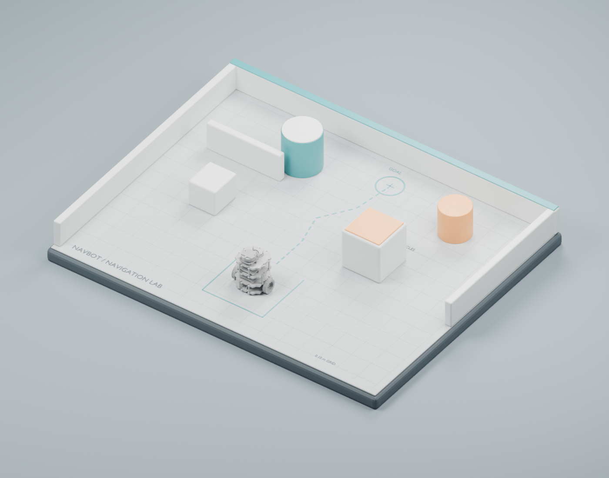
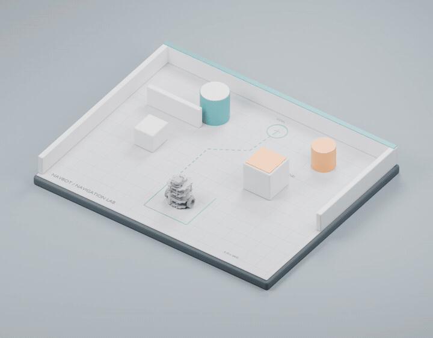
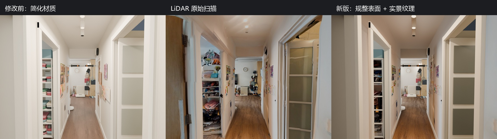
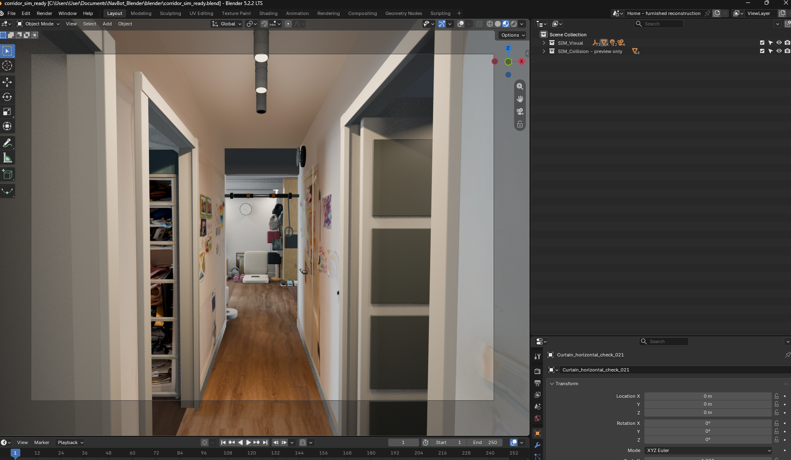
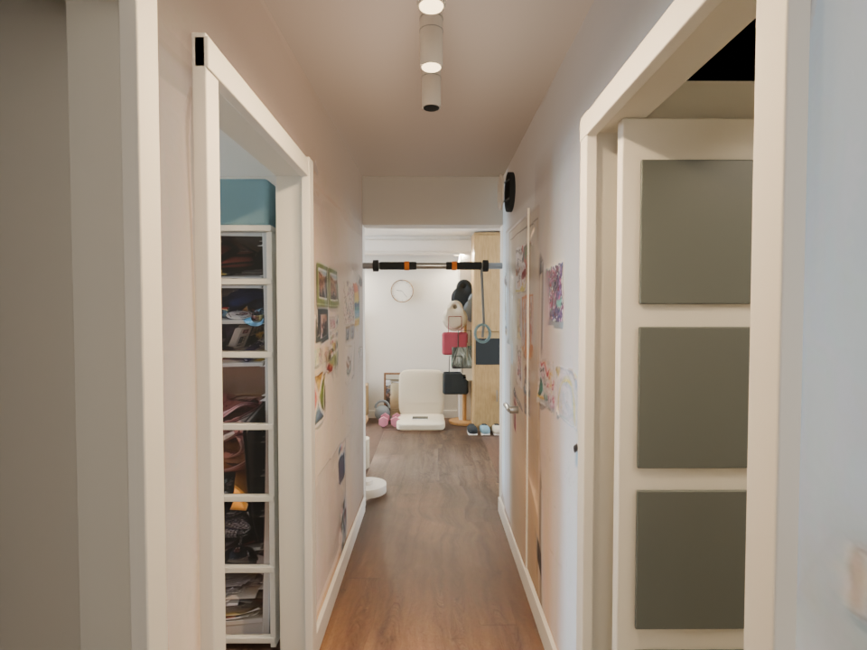
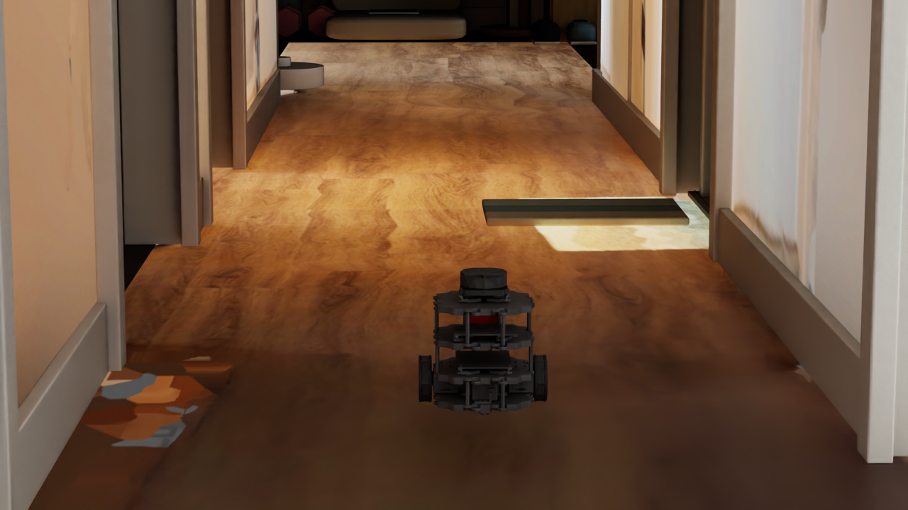
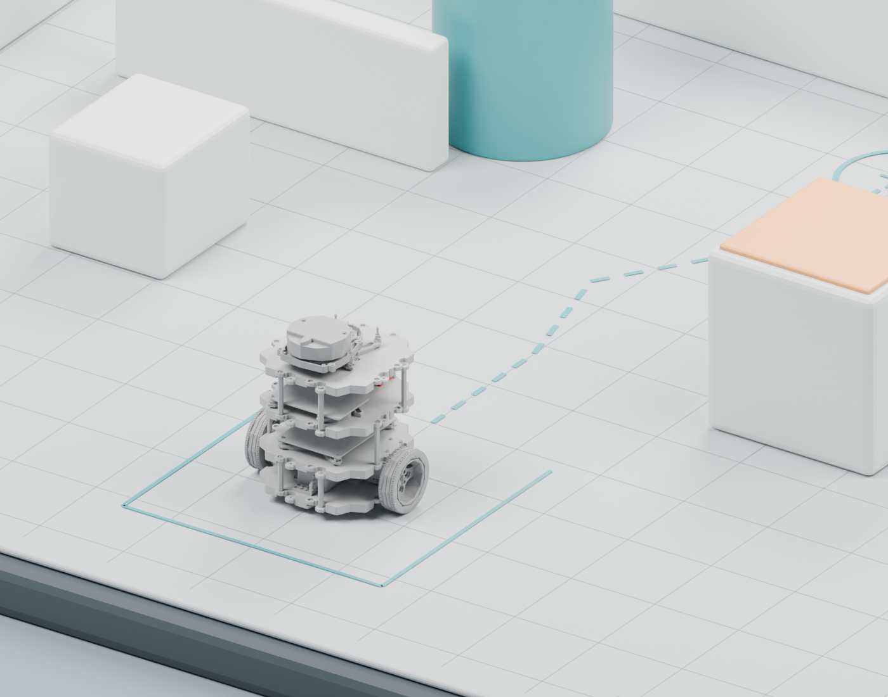

# SimForge Agent

[Website](https://mondaywmd.github.io/monday-robotics-universe/) · [Project & experiments](https://mondaywmd.github.io/monday-robotics-universe/room-capture.html) · [About Monday](https://mondaywmd.github.io/monday-robotics-universe/about.html)

**An AI-agent workflow for creating simulation-ready environments and robot assets across Blender, Isaac Sim, MuJoCo, Gazebo, and ROS.**

SimForge Agent is an early-stage experiment in connecting natural-language agents, digital-content tools, and robotics simulators. The first end-to-end example turns a TurtleBot3 Burger from a ROS/Gazebo workspace into an editable Blender navigation scene, static renders, and an animated navigation sequence.

This repository grew out of an earlier **Gazebo NavBot reinforcement-learning project**. That project established the robot, sensing, navigation baselines, obstacle-avoidance experiments, and evaluation methodology that motivated the asset-generation workflow documented here. SimForge Agent is therefore not a disconnected Blender demo: it is the next infrastructure layer for building reusable digital environments around an existing robotics research pipeline.



### Navigation animation

The 410-frame Blender navigation sequence plays inline as a lightweight GIF preview:



**[Download the full-quality MP4](renders/videos/navbot_navigation_animation.mp4)**

The animation shows the TurtleBot3 Burger leaving its start zone, steering through the generated obstacle layout, rotating its wheels in sync with motion, and stopping at the goal.

## New case study: apartment corridor to Sim-ready USD

The second end-to-end study reconstructs a real indoor corridor from photographs and a Scaniverse LiDAR capture, compares three scene-building approaches, and prepares the selected Blender scene for Isaac Sim.



The tested approaches were:

- **Photo-reference reconstruction** for clean, editable architecture and separated objects.
- **LiDAR mesh repair** for measured proportions and a fast spatial reference, with substantial cleanup required around thin surfaces, holes, and noisy topology.
- **Gaussian Splatting** for a convincing view-dependent appearance, but weak editable geometry, collision preparation, and component separation for this indoor robotics use case.

The selected path combines LiDAR measurements with modular Blender reconstruction and photo-guided materials. It preserves low-noise geometry, separate components, recognizable lighting and materials, and a much clearer path toward collision meshes, semantic structure, and simulator validation.

The Sim-ready handoff keeps `SIM_Visual` and `SIM_Collision` separate, normalizes the environment under one root transform, exports relative USD references, generates a diagnostic occupancy map and route probe, and performs a relocated-folder round-trip check. Local Isaac Sim 6.1 runtime checks now cover rigid-body contact, NavBot driving and one corridor wall. Full-route and sensor validation remain open; see the runtime evidence below.





Read the full [reality-capture study](docs/reality-capture-to-sim-ready.md) and [Isaac Sim handoff notes](docs/isaac-sim-handoff.md).

## Isaac Sim runtime update — September 24, 2026

The generated corridor now supports a local physics test with NavBot: the robot settles, drives about 38 cm along the corridor, and is blocked by a side wall. Flat-ground forward and turn tests passed as well. These are physical simulation results, separate from the earlier Blender navigation animation.



- [Runtime validation record, measurements and limitations](docs/isaac-sim-runtime-validation.md)
- [20-second test video](https://mondaywmd.github.io/monday-robotics-universe/assets/omniverse/navbot-corridor/corridor-test.mp4)
- [Python examples: motion, collision and native capture](adapters/isaacsim/examples/README.md)
- [Illustrated devlog and UI walkthrough](https://mondaywmd.github.io/monday-robotics-universe/isaac-navbot.html)

The examples require the separate NavBot Isaac Sim scenes; they are not a complete simulator adapter. Original fall-through placement, full-room coverage, sensors and autonomous navigation remain unvalidated. The record also documents Play crashes and a synchronous-rendering workaround without claiming a proven root cause.

## What this repository demonstrates

1. Connect VS Code and a Codex agent to a Blender automation workflow.
2. Validate scene control with a simple red-sphere test.
3. Locate and collect a Gazebo robot's URDF, xacro, and mesh dependencies from WSL.
4. Import TurtleBot3 Burger into Blender while preserving scale, link hierarchy, object origins, and joint metadata.
5. Reconstruct navigation environments from requirements, photographs, and LiDAR references.
6. Render static overview and robot-detail frames.
7. Add a collision-checked navigation animation with synchronized wheel rotation.
8. Prepare separated visual/collision assets and a portable USD handoff for Isaac Sim validation.
9. Validate local robot contact, driving and wall blocking in Isaac Sim with scene-specific Python examples.

## Origin: Gazebo NavBot project

The source project studies TurtleBot3 Burger navigation in Gazebo using camera and LiDAR observations, ROS velocity control, and a sequence of classical and learning-based controllers. Its protected direct-goal baseline was validated after restart over ten episodes with 10/10 successes, zero collisions, and zero timeouts.

The project then introduced a reproducible blocked-route benchmark: the robot starts at `(0, 0)`, an orange pillar blocks the direct path at `(1, 0)`, and the target lies at `(2, 0)`. A pure goal-seeking controller intentionally collides with the pillar, giving the experiments a clear control case and a measurable reason to learn a bypass behavior.

The experimental sequence includes:

- bounded residual actions layered over a direct-goal controller;
- native residual PPO rollout and deterministic checkpoint evaluation;
- a LiDAR-triggered control gate for obstacle takeover;
- reward shaping for safer and more efficient bypass behavior;
- behavior cloning from successful demonstrations;
- balanced curriculum and adversarial out-of-distribution evaluation;
- held-out scenario evaluation;
- failure-mode generalization across pose and obstacle variations.

The existing Gazebo work exposed a broader bottleneck: robot-learning experiments need many trustworthy scenes, assets, sensor configurations, and controlled variations. Building those environments manually does not scale. SimForge Agent explores how an AI agent can use Blender or Houdini as an intermediate asset-processing layer, generate simulation-ready environments, apply domain randomization, and export validated assets back to Isaac Sim, MuJoCo, Gazebo, and ROS.

```text
Gazebo NavBot navigation research
        |
        v
Need for repeatable scenes and asset variation
        |
        v
Codex Agent + Blender/Houdini asset pipeline
        |
        v
Simulation-ready environments + domain randomization
        |
        v
Isaac Sim / MuJoCo / Gazebo / ROS
```

This repository contains the Blender and asset-pipeline case studies. The NavBot training code and experiment documentation now live in the separate [navbot-ppo-navigation repository](https://github.com/mondaywmd/navbot-ppo-navigation). See [NavBot project background](docs/navbot-project-background.md) for the connection between the two projects.



## Current pipeline

```text
VS Code + Codex Agent
        |
        v
Blender Python automation
        |
        +-- Red-sphere connectivity test
        +-- Gazebo/URDF robot import
        +-- Reference-guided environment generation
        +-- Static frame validation
        +-- Navigation animation
        +-- GPU rendering
        |
        v
Simulation-ready asset preparation
        |
        +-- Isaac Sim / USD
        +-- MuJoCo / MJCF
        +-- Gazebo / SDF + URDF
        +-- ROS / ROS 2 packages
```

## Quick start

Open one of the Blender files:

- `blender/navbot.blend` — imported robot asset.
- `blender/navbot_navigation_arena.blend` — static navigation arena.
- `blender/navbot_navigation_animation.blend` — animated scene.

To reproduce the stages inside Blender's Scripting workspace:

1. Run `scripts/import_navbot.py` in an empty scene.
2. Run `scripts/build_navigation_arena.py` to build the environment.
3. Run `scripts/animate_navigation.py` to create the animation.

The bundled URDF resolves meshes locally under `assets/`; WSL and ROS are not required to open the Blender files.

## Repository structure

```text
assets/      TurtleBot3 visual assets and upstream license
urdf/        Expanded TurtleBot3 Burger URDF
blender/     Robot, arena, and animation scenes
scripts/     Repeatable Blender automation scripts
renders/     Static images, method comparisons, and video previews
examples/    Machine-readable import and animation reports
docs/        Workflow, architecture, work log, and roadmap
adapters/    Planned adapters and scene-specific Isaac Sim validation examples
```

## Design principle

Blender is used as a visual and asset-processing layer, not as a replacement for the robot description. The URDF remains authoritative for links, joints, collision geometry, inertia, and physical scale. Visual meshes remain separate so the robot can later be imported as an articulation rather than a single merged object.

For cross-simulator support, the project will evolve toward a canonical scene representation containing visual geometry, collision geometry, materials, semantic labels, rigid bodies, joints, inertial properties, sensors, and coordinate conventions. Platform-specific adapters will generate USD, MJCF, SDF, and ROS assets from that representation.

## Roadmap

- [x] Add the completed navigation MP4.
- [x] Add a lightweight preview GIF for inline playback.
- [x] Prepare a portable corridor USD package and offline validation scripts.
- [x] Run local Isaac Sim rigid-body, NavBot motion and corridor collision checks.
- [ ] Expand collision coverage, navigation, RGB, depth, and RTX LiDAR validation.
- Add MuJoCo MJCF and Gazebo SDF adapters.
- Generate collision proxies, inertial estimates, and semantic labels.
- [x] Compare photograph, LiDAR, and Gaussian Splatting inputs for an indoor corridor.
- [x] Add Blender-based architecture reconstruction and LiDAR cleanup experiments.
- Add domain randomization for geometry, materials, lighting, sensors, and physics.
- Build closed-loop validation across simulators.

See [Architecture](docs/architecture.md), [AI work log](docs/ai-work-log.md), and [Roadmap](docs/roadmap.md).

## Third-party assets

TurtleBot3 description files and meshes are derived from ROBOTIS TurtleBot3 version 1.2.0 and retain the upstream Apache License 2.0 at `assets/turtlebot3_description/LICENSE`. The original WSL/ROS/Gazebo workspace was not modified.

## Status

Research prototype. The Blender workflow is reproducible, and scene-specific Isaac Sim runtime examples have been exercised. General simulator adapters and bidirectional validation remain planned work.
