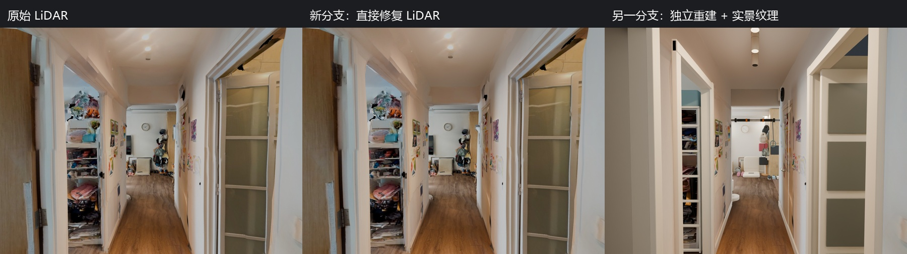
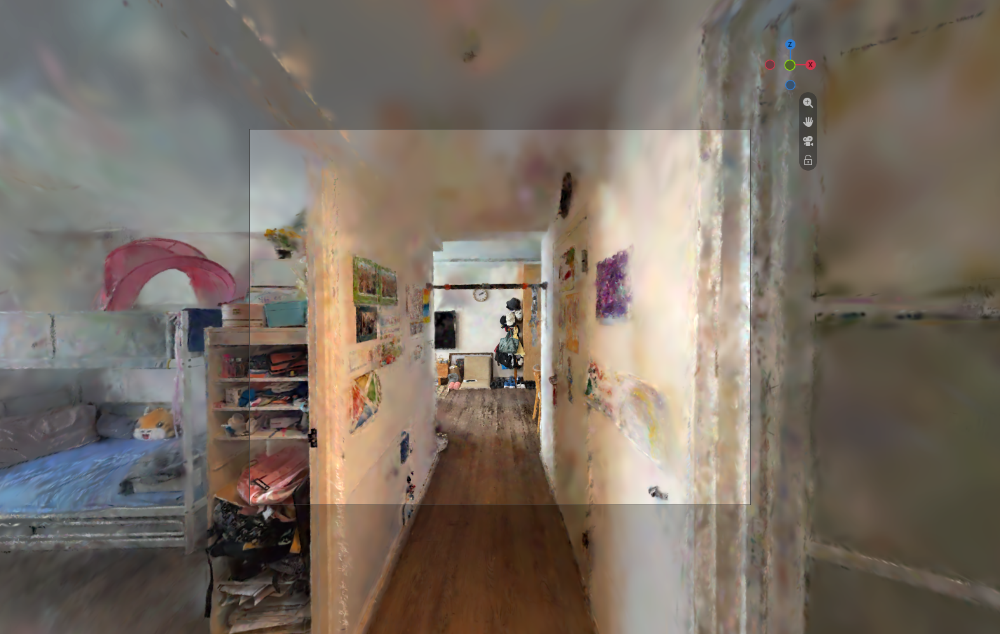

# Reality capture to Sim-ready scene

**Study date:** 2026-09-23

**Environment:** narrow indoor apartment corridor

**Goal:** preserve recognizable appearance while producing editable geometry suitable for robotics simulation preparation

## Question

Which reconstruction method gives the best starting point for a robot-training environment: direct photo reconstruction, a repaired LiDAR mesh, or Gaussian Splatting?

The answer depends on the deliverable. A visually convincing fly-through is not the same as a scene whose walls, floor, doors, furniture, collision geometry, materials, and semantics can be edited and validated independently.

## Inputs

- Scaniverse LiDAR capture used for spatial evidence and scale.
- Fifteen reference photographs covering the corridor and adjacent rooms.
- Blender 5.2 for reconstruction, cleanup, organization, rendering, and export preparation.
- A TurtleBot-sized route and footprint used for preliminary geometric checks.

Original personal photographs and raw scans are intentionally not published in this repository. The checked-in images are selected comparison and validation evidence.

## Method 1 — modular photo-reference reconstruction

The scan supplied the initial coordinate frame and wall evidence. Separate walls, door openings, floor, ceiling, trim, furniture, fixtures, and decorative elements were then reconstructed in Blender. Photographs were perspective-corrected and used to guide placement, color, textures, lighting, and small details.

**Strengths**

- Clean, low-noise geometry.
- Architecture and objects remain separate and editable.
- Materials, lighting, collision, and semantic roles can evolve independently.
- Door openings and robot-clearance regions can be inspected directly.

**Limitations**

- Hidden regions require reasonable reconstruction rather than measured truth.
- Fine furniture shapes and baked lighting in captured textures remain approximations.
- A reliable physical measurement is still needed for final scale calibration.

## Method 2 — LiDAR mesh repair

The captured mesh was analyzed, repaired, retextured, and rendered from matched views. It remained valuable as evidence and as a spatial reference.



**Strengths**

- Fast access to real spatial proportions.
- Useful guide for wall positions, opening widths, and room extents.
- Preserves some appearance directly from capture.

**Limitations**

- Noise, holes, thin surfaces, fused objects, and uneven topology.
- Hard to assign stable component identity or simplified collision behavior.
- Captured illumination is mixed into texture appearance.

## Method 3 — Gaussian Splatting

The Scaniverse splat was imported and inspected from several corridor viewpoints.



It looked attractive from supported views, but this indoor capture showed blurred boundaries, weak thin features, view-dependent artifacts, and no natural separation between walls, furniture, doors, or obstacles. Those traits are tolerable for view synthesis but poor foundations for collision and robotics semantics.

## Decision matrix

| Criterion | Modular reconstruction | Repaired LiDAR | Gaussian Splatting |
| --- | --- | --- | --- |
| Visual resemblance | High | Medium | High from supported views |
| Editable components | High | Low | Very low |
| Geometry noise | Low | High | Not conventional surfaces |
| Collision preparation | Strong | Difficult | Unsuitable directly |
| Material control | Strong | Limited | View-dependent |
| Sim-ready path | Best | Reference / fallback | Visual reference only |

## Selected pipeline

```text
LiDAR spatial evidence + reference photographs
                     |
                     v
       modular Blender reconstruction
                     |
        +------------+-------------+
        |                          |
   protected visual scene   simplified collision scene
        |                          |
        +------------+-------------+
                     v
          portable USD handoff
                     |
                     v
        target-simulator validation
```

This is not a rejection of LiDAR or Gaussian Splatting. Each representation is kept in the role where it is strongest: LiDAR for measurement evidence, splats for visual reference, and modular geometry for editable simulation assets.

## Reproducibility notes

The `scripts/reality_capture/` folder contains the main reconstruction, LiDAR repair, hierarchy organization, USD package, and normalization scripts. They are research scripts built around named scene collections and require the corresponding local source data. They document the transformation logic; they are not a one-command public dataset reproduction because the raw home capture is not distributed.
